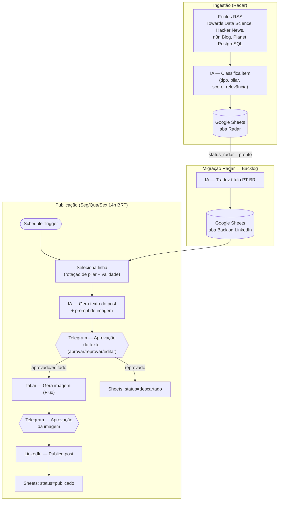

# LinkedIn Auto Post

Automação pessoal que gera, revisa e publica posts técnicos no LinkedIn — combinando
ingestão de conteúdo por RSS, geração de texto/imagem por IA, aprovação humana via
Telegram e publicação automática, tudo orquestrado em n8n.

> Este é um projeto pessoal de portfólio: mostra como estruturei um pipeline de
> conteúdo human-in-the-loop com n8n, não um produto genérico pronto pra qualquer um
> rodar sem configuração.

## Por que esse projeto existe

Eu queria manter uma cadência de posts técnicos no LinkedIn sobre dados, IA, SQL, n8n e
tecnologia, sem cair em dois problemas comuns de automação de conteúdo:

- **Publicar lixo genérico gerado por IA sem revisão** — por isso todo texto e toda
  imagem passam por uma aprovação humana explícita antes de ir ao ar.
- **Ficar sem pauta** — por isso existe um "radar" que varre fontes RSS continuamente e
  classifica os itens por relevância, alimentando um backlog que nunca fica vazio.

## Arquitetura



### Os dois modos de publicação

1. **Automático (pilares de conteúdo)** — o fluxo acima, 100% orquestrado pelo n8n,
   rodando Seg/Qua/Sex às 14h BRT. Cobre os pilares `dado | ia | sql | n8n | tech`,
   rotacionando pra nunca repetir o mesmo pilar duas vezes seguidas.
2. **Manual (projetos pessoais)** — posts sobre a minha própria evolução/projetos não
   vêm de RSS nenhum. Eu trago o material numa conversa, o texto é montado junto comigo,
   e a publicação é sempre manual ou autorizada por mim post a post — nunca automática.

### Por que aprovação humana em 2 pontos (texto e imagem)

Cada chamada de IA é boa, mas não confiável o bastante pra publicar sem revisão. O
`sendAndWait` do Telegram pausa a execução do workflow até eu responder, com 3 opções no
texto (aprovar / reprovar / editar — posso colar um texto corrigido que substitui o da
IA) e 2 na imagem (aprovar / publicar só com texto).

## Stack

| Camada | Ferramenta |
|---|---|
| Orquestração | [n8n](https://n8n.io/) self-hosted (Docker), versionado como código via [n8nac](https://www.npmjs.com/package/n8nac) |
| Dados/estado | Google Sheets (planilha "Backlog LinkedIn": backlog + radar) |
| Geração de texto | Google Gemini |
| Geração de imagem | [fal.ai](https://fal.ai/) (Flux) |
| Aprovação humana | Telegram Bot API (`sendAndWait`) |
| Publicação | LinkedIn API (OAuth2, `w_member_social`) |
| Exposição pública | Cloudflare Tunnel (necessário pro `sendAndWait` do Telegram funcionar com n8n self-hosted) |

## Estrutura do repositório

```
workflows/linkedin/
  Linkedin AI POST.workflow.ts   # fonte da verdade do workflow (n8n-as-code)
  README.md                      # decisões de implementação específicas do workflow
docker-compose.yml                # sobe o n8n localmente
n8nac-config.json                 # aponta o n8nac pro ambiente n8n local
.env.example                      # variáveis necessárias (copie pra .env)
```

O workflow nunca é editado direto na UI do n8n — todo o histórico de decisões e bugs
fica no `.workflow.ts`, sincronizado via `npx n8nac push/pull`.

## Rodando localmente

1. `docker compose up -d` — sobe o n8n em `http://localhost:5678`.
2. Crie as credenciais no n8n: Google Sheets OAuth2, Telegram Bot API, LinkedIn OAuth2
   (app criado depois de ago/2023 precisa desmarcar o toggle `legacy` na credencial),
   Google Gemini API, fal.ai (HTTP Header Auth).
3. Copie `.env.example` pra `.env` e preencha:
   - `LINKEDIN_SHEET_ID` — ID da sua planilha do Google Sheets
   - `TELEGRAM_CHAT_ID` — chat que recebe as aprovações
   - `LINKEDIN_PERSON_URN` — seu identificador de pessoa no LinkedIn
   - `N8N_WEBHOOK_URL` — URL pública do seu n8n (necessária pro botão de aprovação do
     Telegram funcionar; um túnel tipo Cloudflare Tunnel ou ngrok resolve isso sem custo)
4. `npx n8nac env auth set <nome>` — autentica o n8nac com uma API key gerada em
   *Settings → n8n API* no n8n.
5. `npx n8nac push "workflows/linkedin/Linkedin AI POST.workflow.ts" --verify`.

## Planilha (Google Sheets)

Uma única planilha, duas abas:

- **Backlog LinkedIn**: `titulo | link_fonte | pilar | status | contexto | data_publicacao | texto_final | imagem_usada | tipo | data_fonte | score_relevancia`
- **Radar**: itens brutos coletados por RSS antes de virarem candidatos a post, com
  `score_relevancia` calculado por IA e `status_radar` controlando a curadoria manual
  de quais migram pro backlog.

## Decisões de arquitetura que valem destacar

- **`onError: continueErrorOutput` + retry em todo node externo** — qualquer falha de
  API (Gemini, fal.ai, Sheets) cai num branch de erro que notifica no Telegram com o
  nome do node e a mensagem original, em vez de o workflow simplesmente morrer em
  silêncio.
- **Regra de expiração de notícia** — itens classificados como `noticia` (vs.
  `informativo`) expiram depois de 7 dias entre a data da fonte e hoje, pra nunca
  publicar uma "novidade" velha.
- **`$('nome do node')` quebra depois de um `sendAndWait`** — descoberto em produção:
  qualquer referência cruzada a um node anterior ao resume de um `Wait` para de
  funcionar. A correção foi usar só `$json`/`$input` e, quando um HTTP Request substitui
  o payload do item (fal.ai, download de imagem), recompor os campos originais com um
  node Merge (`combineByPosition`) logo depois.
- **Variáveis sensíveis via `$env`, não hardcoded** — IDs pessoais (planilha, chat do
  Telegram, URN do LinkedIn) são lidos de variáveis de ambiente do container Docker, não
  do próprio workflow — o que deixa o `.workflow.ts` seguro pra ficar público.
